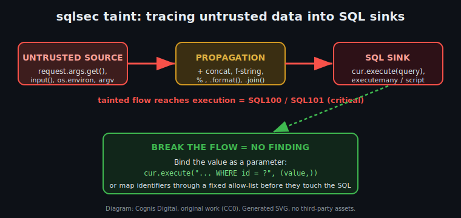

# Data-flow (taint) analysis — `sqlsec taint`

> Defensive / educational static analysis. `sqlsec` reads source text and
> reports. It does not execute attacks, connect to a database, or run the SQL it
> inspects. Maintainer: **Cognis Digital**. License: COCL 1.0.



*Diagram: Cognis Digital, original work (CC0 / public domain dedication). It is a
hand-authored SVG — no third-party or scraped assets.*

---

## Why a second engine

`sqlsec lint` is a **line-by-line heuristic**. It is fast, dependency-free, and
catches the dangerous *construction patterns* (`+`, f-strings, `%`, `.format()`,
dynamic `EXEC`) on the line where they appear. That design has two well-known
blind spots, and they pull in opposite directions:

1. **It misses multi-line flows (false negatives).** Real injection bugs rarely
   fit on one line. Input is read in one statement, glued into a query string in
   another, and executed a few lines later:

   ```python
   def search(request, cur):
       name  = request.args.get("name")          # source
       query = "SELECT * FROM users WHERE name = '" + name + "'"  # build
       cur.execute(query)                          # sink
   ```

   The line linter sees a concatenation on line 3 (it may flag SQL001) and a
   bare `execute(query)` on line 4 (SQL009). Neither *knows* the value came from
   the request. If the build used `.format()` of what looks like a constant, or
   spanned a helper variable, the line linter can lose the thread entirely.

2. **It over-reports safe code (false positives).** A query assembled with
   `.format()` from a value chosen entirely in code is **not** an injection bug,
   but a pattern matcher flags it anyway:

   ```python
   column = "name"                          # a constant, never input
   query  = "SELECT {} FROM users".format(column)
   cur.execute(query)                       # SQL004 fires — but this is safe
   ```

`sqlsec taint` is the complementary engine. It parses the file into a Python
**AST** and answers a different, higher-value question: *does an untrusted value
actually reach a SQL execution sink, while still untrusted?* When the answer is
yes, it is a high-confidence finding (`SQL100` / `SQL101`, critical). When the
data flow is broken — by parameter binding, by an allow-list, by a constant —
it stays silent.

Run both. The line linter is your wide net; the taint engine is your
high-precision confirmation and your multi-line safety net.

---

## What it tracks

### Untrusted sources

The engine seeds taint from documented, real entry points (no invented APIs):

| Category | Forms recognized |
| --- | --- |
| Flask / WSGI request | `request.args`, `request.form`, `request.values`, `request.json`, `request.data`, `request.cookies`, `request.headers`, `request.files`, `request.get_json()` |
| Django request | `request.GET`, `request.POST`, `request.COOKIES`, `request.body` |
| ASGI / FastAPI-style | `request.query_params`, `request.path_params` |
| Process / OS | `input()`, `os.environ`, `os.getenv(...)`, `sys.argv` |
| Conservative default | every **function parameter** (unless `--explicit-only`) |

Request objects are recognized when the base name is `request`, `req`, or
`flask_request` and the accessor is one of the source attributes above —
e.g. `request.args.get("q")`, `req.form["x"]`.

### Taint propagation

Taint flows through the expression forms that splice data into text:

- string concatenation (`+`) and augmented concatenation (`+=`)
- f-strings (`f"... {value} ..."`)
- `%`-formatting (`"... %s" % value`)
- `str.format()` (positional **and** keyword args) and `"sep".join([...])`
- `str()` / `repr()` / `format()` wrappers
- subscripts of tainted collections, tuple/list elements, `a or b` choices
- assignment chains (`a = source; b = a; c = "..." + b`)

Reassigning a variable from a **clean** value clears its taint; aliasing it from
a tainted value carries it.

### SQL sinks

`execute`, `executemany`, `executescript`, and `executescriptmany` on any
receiver. The **first positional argument** is the query. For `execute` /
`executemany`, a tainted query argument is the bug — note that the *params*
argument (`(value,)`) is exactly the safe channel, so binding a tainted value
there is **not** flagged. `executescript` accepts no params at all, so a tainted
script is always critical (`SQL101`).

---

## A real-use-case walkthrough

You inherit a Flask analytics service and want to know where request data
reaches the database before it ships. `views.py`:

```python
import os

def report(request, cur):
    region = request.args.get("region")
    where  = "WHERE region = '" + region + "'"
    query  = "SELECT host, status FROM sensors " + where
    cur.execute(query)                       # (A) tainted

def export(cur):
    fmt = "csv"
    cur.execute("SELECT * FROM sensors LIMIT 100")   # (B) constant, safe

def maintenance(request, cur):
    sql = request.form["script"]
    cur.executescript("BEGIN;" + sql)        # (C) tainted, no params possible
```

Run the high-precision pass (only explicit sources, ignore bare params):

```bash
sqlsec taint views.py --explicit-only
```

```
SEVERITY  RULE    LOCATION       MESSAGE
--------  ------  -------------  ----------------------------------------------------------
CRITICAL  SQL100  views.py:7:5   tainted data flow: request.args.get() (line 4) reaches
                                  .execute() -- untrusted value is built into the query text
CRITICAL  SQL101  views.py:16:5  tainted data flow: request.form (line 15) reaches
                                  .executescript() -- runs every statement and binds nothing

2 tainted flow(s): 2 critical
```

Function `export` (B) is **not** reported — its query is a constant. That is the
precision payoff: the engine tells you the two places that actually need fixing
and stays quiet on the one that doesn't.

Fix (A) by binding, and (C) by refusing dynamic scripts:

```python
def report(request, cur):
    region = request.args.get("region")
    cur.execute("SELECT host, status FROM sensors WHERE region = ?", (region,))
```

Re-run — clean. Wire it into CI as a hard gate:

```bash
sqlsec taint . --fail-on high          # exit 1 if any high+/critical flow remains
sqlsec taint . --sarif > taint.sarif   # upload to GitHub code scanning
```

### Two modes, deliberately

- **Default (parameter-seeded).** Every function parameter is assumed
  untrusted. This is the standard conservative posture for a security linter:
  intra-procedurally we cannot prove a caller passed something safe, so we don't
  assume it. High recall — good for a first audit.
- **`--explicit-only`.** Only flows that begin at an *explicit* untrusted source
  (request data / `input()` / env / argv) are reported. High precision — good
  for a CI gate where you want zero noise.

---

## Threat & defensive context (frank and technical)

SQL injection remains a top-tier web risk (OWASP Top 10 A03:2021 — Injection)
because the root cause is structural, not exotic: when input is concatenated
into a query, the database parser cannot tell the attacker's *data* from the
program's *code*. A value like `' OR '1'='1` stops being a name and becomes a
clause. `'; DROP TABLE users; --` stops being a search term and becomes a second
statement. The fix has been known for two decades — **bound parameters keep the
statement's structure fixed in code and pass values out-of-band** — yet the bug
persists because the unsafe pattern is the *convenient* one and the data flow
that makes it dangerous is often spread across several lines.

That spread is exactly the gap a per-line linter leaves and a taint engine
closes. Detection-and-analysis tooling like this is force protection for a
codebase: it surfaces the reachable, exploitable flows so engineers fix the few
that matter instead of drowning in pattern-match noise (which trains people to
ignore the tool — the worst outcome for any security control).

**Limits, stated honestly.** This engine is intra-procedural and linear:

- It analyzes one function body at a time and does **not** follow taint across
  function calls (a source returned by your own helper, then passed to a sink in
  another function, is not connected). The parameter-seeded default partly
  compensates by treating *every* parameter as untrusted.
- It does not precisely model branches, loops, or exceptions; on a branch it
  conservatively keeps any taint it has seen (favoring recall).
- It cannot see sanitization it doesn't recognize. If you validate a value with
  a custom function, the engine still treats it as tainted (a false positive you
  can suppress with `--explicit-only` or by binding anyway — binding is free).
- A clean run is **not** a proof of safety. Treat `sqlsec` as one layer
  alongside code review, parameterized queries by default, least-privilege
  database accounts, and input validation — defense in depth, not a silver
  bullet.

What it deliberately does **not** do: it never executes the SQL, never connects
to a database, never crafts or runs an exploit, and ships no attack payloads.
Its entire job is to read your source and point at the data flows that would let
someone else attack you.

---

## Rule reference

| ID | Severity | Fires when |
| --- | --- | --- |
| `SQL100` | critical | An untrusted value reaches `execute` / `executemany` built into the query *text* (not bound as a parameter). |
| `SQL101` | critical | An untrusted value reaches `executescript`, which runs every statement and binds nothing. |

```bash
sqlsec explain SQL100
sqlsec explain SQL101
```

## Try the bundled fixtures

```bash
sqlsec taint examples/taint_flow.py --explicit-only   # 9 critical flows
sqlsec taint examples/taint_safe.py --explicit-only   # clean
sqlsec taint examples/taint_safe.py                   # clean even param-seeded
```

`examples/taint_flow.py` exercises every source kind and every propagation form
across multi-line flows; `examples/taint_safe.py` is the parameterized /
allow-listed counterpart and lints clean in both modes — including the
`.format()`-of-a-constant case the line linter would flag.
